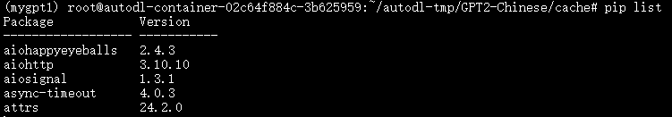
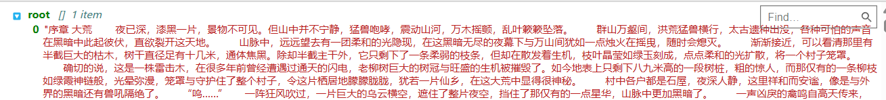
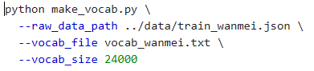
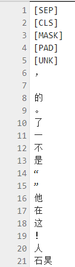
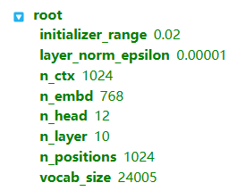
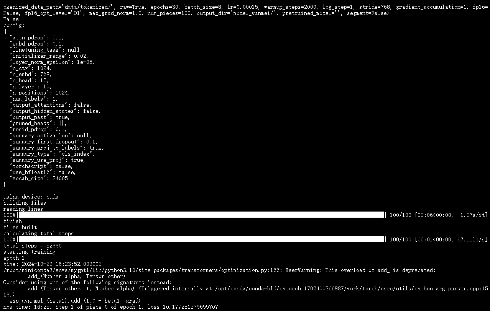
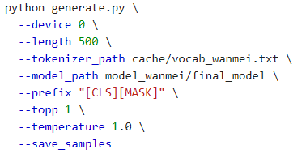
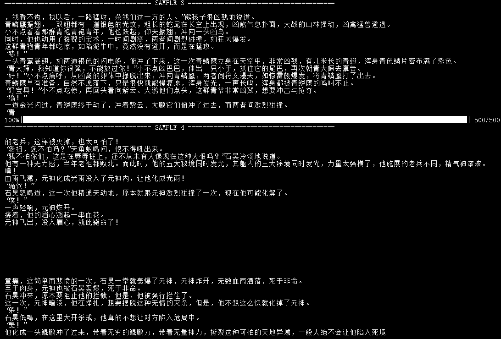
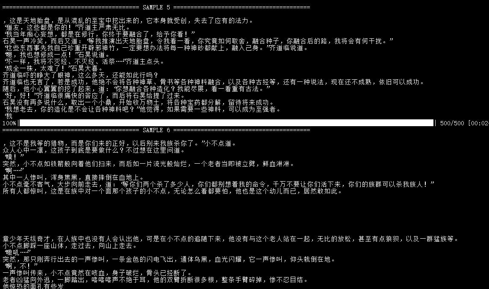
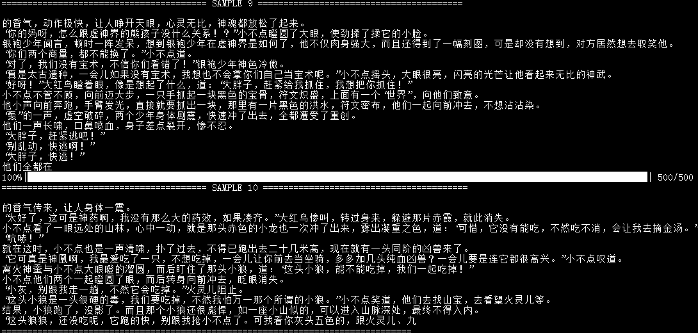

# GPT2-wanmeishijie

## Description

- 中文的GPT2训练代码，采用了BERT的tokenizer，以小说完美世界作为训练集进行训练了30个epoch


## 文件结构

- cache文件夹中，make_vocab.py为BERT词表生成文件，vocab_wanmei.txt为以小说完美世界作为训练语料生成的词表文件，make_vocab.sh为生成词表的脚本
- config文件夹中存放模型参数文件
- data文件夹中的trian_wanmei.json中存放着训练集小说
- tokenizations 文件夹内是可以选用的三种tokenizer，包括默认的Bert Tokenizer，分词版Bert Tokenizer以及没有word piece的Bert Tokenizer
- generate.py 与 train.py 分别是生成与训练的函数
- generate.sh 与 train.sh 分别是生成与训练的脚本
- requirements.txt为环境配置文件


## 前期准备
- 首先根据requirements.txt配置环境mygpt1
- 
- 环境配置完成后，将训练语料放入data文件夹的trian_wanmei.json中
- 
- 使用cache文件夹中的make_vocab_wanmei.py生成待训练小说完美世界的词表。

``` bash
sh make_vocab.sh
```
- 词表的大小可以通过make_vocab.sh中的vocab_size控制，注意确保词表大小与config文件夹中模型配置文件的vocab_size大小一致。
- 
- 
- 前五行为特殊 token 符号
- [UNK]：表示未知标记（即，词汇表中没有的词）；
- [SEP]：表示句子分隔符；换行
- [PAD]：表示填充标记，用于填充序列的长度；也就是无效符号。 pad_token_id默认为tokenizer.eos_token_id，这是特殊token [EOS]的位置。它被用来指示模型当前生成的句子已经结束，因此当我们想要生成一个开放式文本时，我们可以将pad_token_id设置为eos_token_id，以确保生成文本不会被提前结束。
- [CLS]：表示分类标记，用于BERT模型的分类任务；文章之间添加CLS表示文章结束
- [MASK]：表示掩码标记，用于BERT模型的掩码语言建模任务。文章开头添加MASK表示文章开始


## 训练过程

- 前置准备完成后，下面开始训练
使用train.sh脚本，即可进行训练

``` bash
 sh train.sh
```
- 
- --raw表示对数据进行预处理，即生成tokenized后的训练文件。
训练使用的模型配置文件为
- 
- 运行命令后开始训练
- 
- 将训练语料分割成100份，选择的网络为小型GPT2网络结构，其中n_layer=10，n_head=12，n_embd=12*64=768。
训练30个epoch后loss值下降到约1.4


## 生成文本

- 训练完成后，使用generate.sh脚本生成小说文字
- 

``` bash
 sh generate.sh
```
- 即可生成10段小说文字，结果保存在sample.txt中
- 
- 
- 
- 
- 


## Citing

```
@misc{GPT2-Chinese,
  author = {Zeyao Du},
  title = {GPT2-Chinese: Tools for training GPT2 model in Chinese language},
  year = {2019},
  publisher = {GitHub},
  journal = {GitHub repository},
  howpublished = {\url{https://github.com/Morizeyao/GPT2-Chinese}},
}
```


