# GPT2-wanmeishijie

## Description

- The Chinese GPT2 training code, using BERT's tokenizer, trained 30 epochs with the novel Perfect World as the training set


## File structure

- cache folder, make_vocab.py generate the BERT vocabulary file, vocab_wanmei.txt the vocabulary file generated with the novel Perfect World as the training corpus, and make_vocab.sh the script that generates the vocabulary
- config folder to store the model parameter file
- The trian_wanmei.json in the data folder contains the training set novel
- There are three types of tokenizers available in the tokenizations folder, including the default Bert Tokenizer, the tokenizer version, and the Bert Tokenizer without a word piece
- generate.py and train.py are functions for generation and training, respectively
- generate.sh and train.sh are generated and trained, respectively
- requirements.txt is an environment profile


## Preparation
- First, configure the environment mygpt1 according to the requirements.txt
- 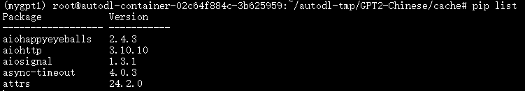
- After the environment is configured, put the training corpus into the trian_wanmei.json of the data folder
- 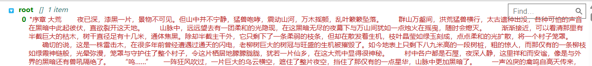
- Use the make_vocab_wanmei.py in the cache folder to generate a vocabulary of the perfect world of the novel to be trained.

``` bash
sh make_vocab.sh
```
- The size of the vocabulary can be controlled by the vocab_size in the make_vocab.sh, take care to ensure that the vocabulary size is consistent with the vocab_size size of the model configuration file in the config folder.
- 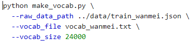
- 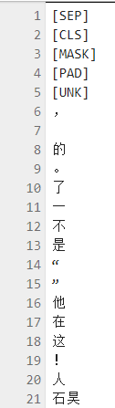
- The first five lines are special token symbols
- [UNK]: indicates an unknown tag (i.e., a word that is not in the vocabulary);
- [SEP]: indicates a sentence separator; Line breaks
- [PAD]: indicates a fill marker, which is used to fill the length of the sequence; That is, invalid symbols. pad_token_id defaults to tokenizer.eos_token_id, which is where the special token [EOS] is located. It is used to indicate that the currently generated sentence of the model has ended, so when we want to generate an open-ended text, we can set the pad_token_id to eos_token_id to ensure that the generated text is not terminated prematurely.
- [CLS]: represents classification tags, which are used for classification tasks of BERT models; Adding CLS between articles indicates the end of the article
- [MASK]: indicates a mask marker, which is used for the mask language modeling task of the BERT model. Adding a mask at the beginning of an article indicates the beginning of an article


## Training process

- After the pre-preparation is complete, the next step is to start training
Use train.sh script and you're ready to train
``` bash
 sh train.sh
```
- 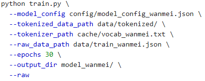
- --raw indicates that the data is preprocessed, that is, the tokenized training file is generated.
The model configuration file used for training is
- 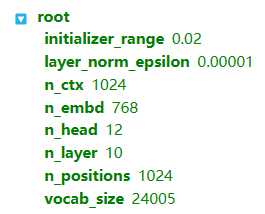
- Start training after running the command
- 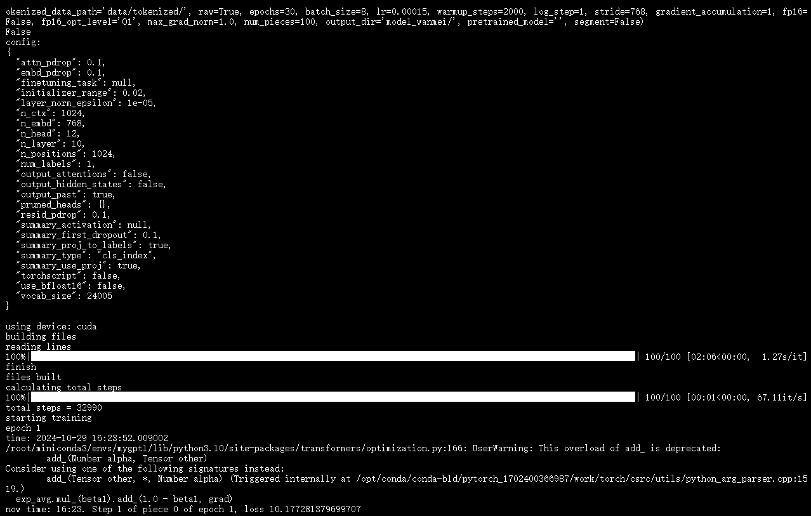
- The training corpus was divided into 100 parts, and the selected network was a small GPT2 network structure, where n_layer=10, n_head=12, n_embd=12*64=768.
After 30 epochs of training, the loss value drops to about 1.4


## Generate text

- Once the training is complete, use generate.sh script to generate the text of the novel
- 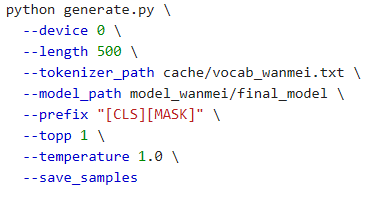
``` bash
 sh generate.sh
```
- to generate 10 paragraphs of novel text, and the result is saved in the sample.txt
- 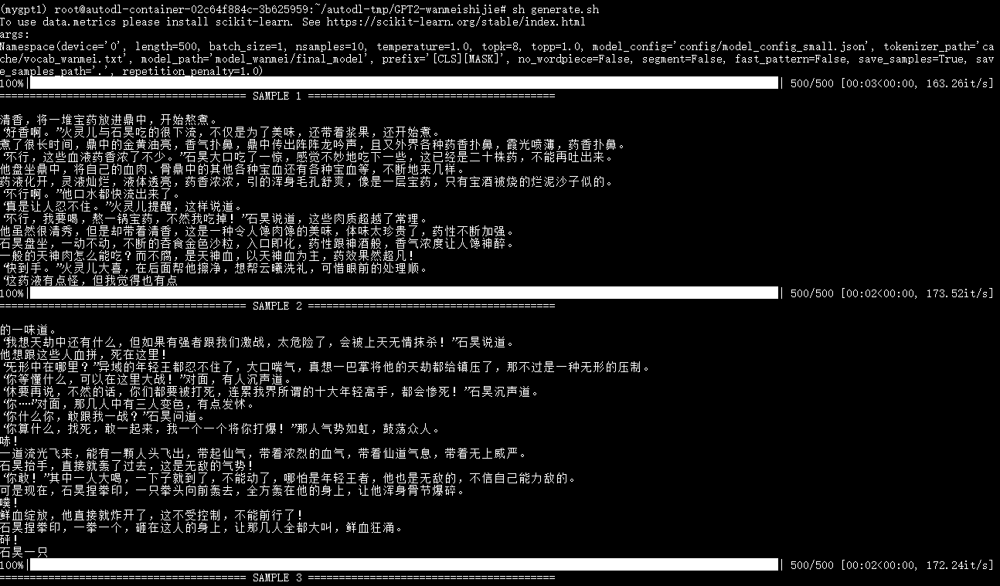
- 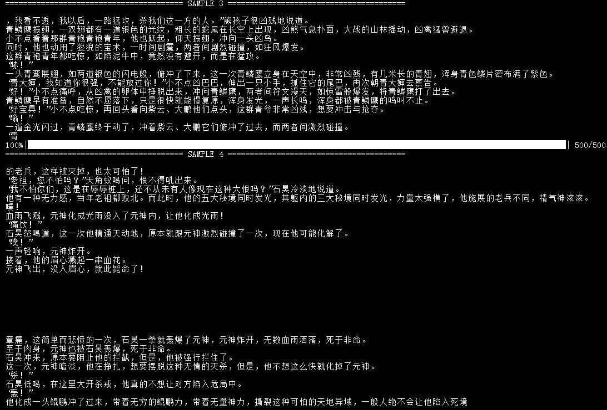
- 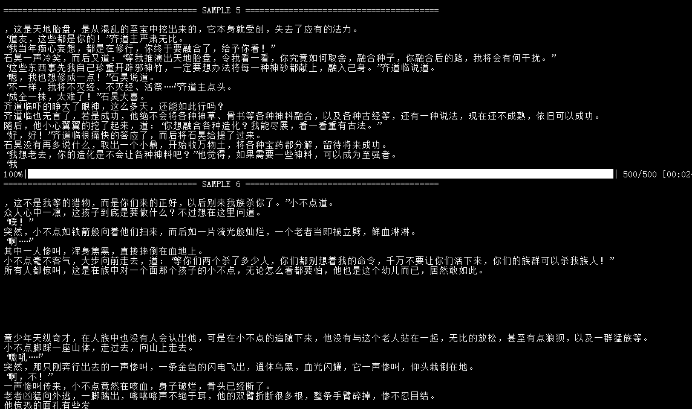
- 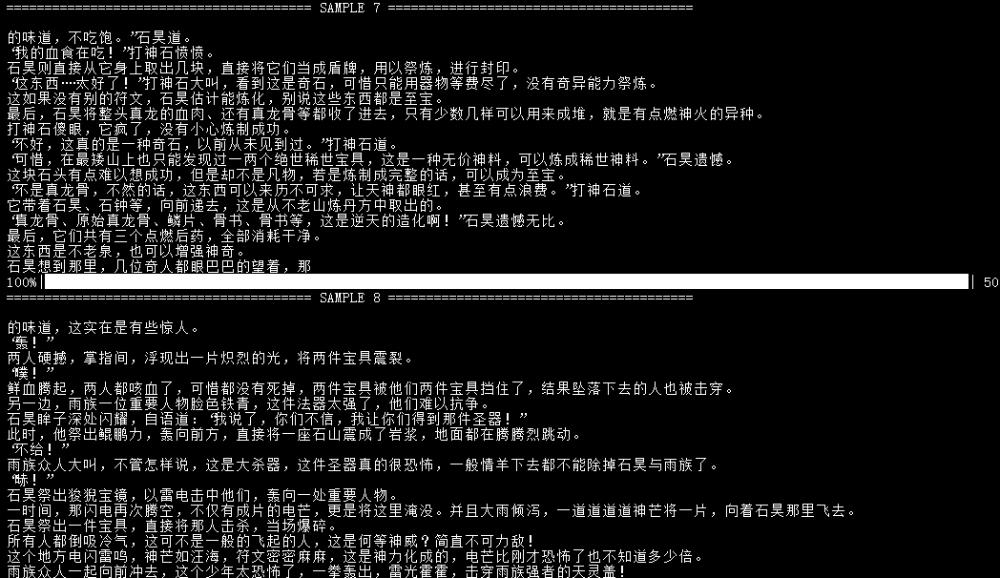
- 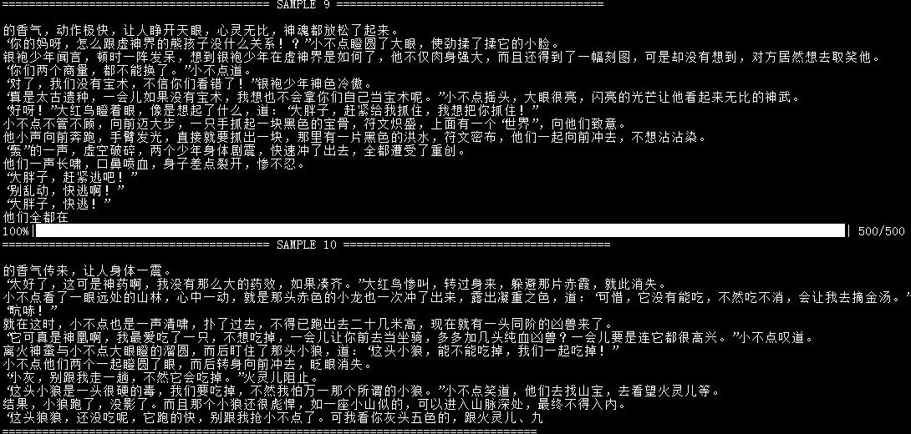


## Citing

```
@misc{GPT2-Chinese,
  author = {Zeyao Du},
  title = {GPT2-Chinese: Tools for training GPT2 model in Chinese language},
  year = {2019},
  publisher = {GitHub},
  journal = {GitHub repository},
  howpublished = {\url{https://github.com/Morizeyao/GPT2-Chinese}},
}
```


